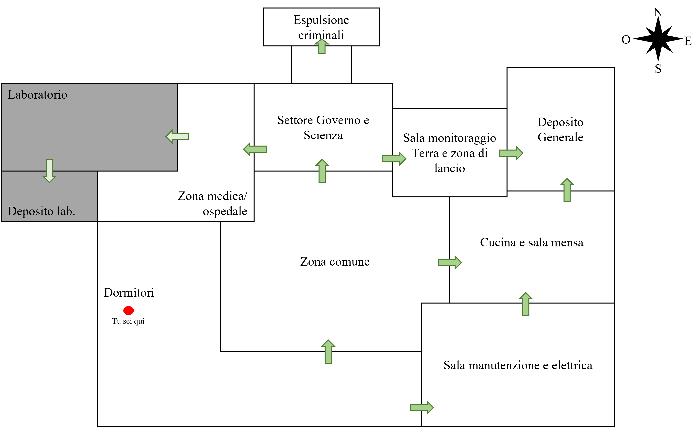
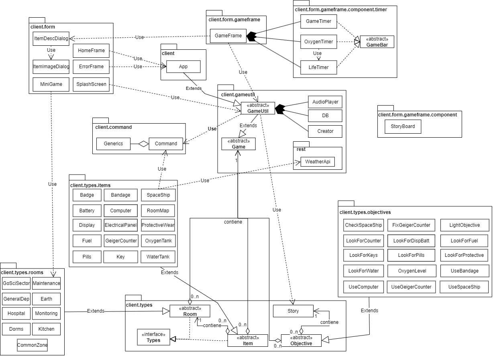

# Escape From the Space - Documentazione

## 1. Introduzione
Gioco basato sulla combinazione dei due stili di avventura: testuale e grafica.
Abbiamo preso ciò che ritenevamo migliore della parte testuale e arricchita con dettagli e funzionalità grafiche.

L’avventura è facilmente estendibile e modificabile, poiché, durante la creazione abbiamo pensato molto a come utilizzare il paradigma ad oggetti per enfatizzare questo aspetto.

La trama trae qualche spunto dalla serie tv The 100. Il compito principale del giocatore è quello di completare tutti gli obbiettivi che gli permetteranno di scappare dalla Stazione Spaziale ed arrivare sulla Terra.

Sono presenti anche due minigiochi molto semplici che servono ad intrattenere il giocatore così da rendergli più difficile la gestione del tempo (c’è anche la possibilità di morire per questo (mezzo spoiler)).

Abbiamo pensato che il giocatore potesse avere difficoltà con le meccaniche del gioco, per questo, abbiamo aggiunto un comando `Aiuto` (parte in automatico ogni nuova partita), che è possibile chiamare in un qualsiasi punto del gioco.

Nell’interfaccia sono presenti tre sotto interfacce oltre quelle del tempo, la casella di input e il pannello della storia. Queste tre interfacce sono:
- Inventario → diviso in slot, contiene gli oggetti posseduti dal giocatore, cliccando su un oggetto è possibile vederne le informazioni, cliccando sull'immagine dell'interfaccia delle informazioni, è possibile ingrandire la foto per vederne i dettagli (alcune immagini potrebbero cambiare durante lo svolgimento);
- Lista degli obbiettivi → indica l'/gli obbiettivo/i attualmente da completare;
- Lista dei comandi → indica i comandi disponibili in quel momento.

---

### 1.1 Ambientazione e personaggio principale
**Personaggio principale**
In questa avventura impersonerai i panni di Raven, un ingegnere aerospaziale ventisettenne, nato sulla Stazione Spaziale chiamata comunemente `Arca`.

**Mappa**

All'inizio dell'avventura sarai all'interno della stanza 'Dormitori'.

Le stanze in grigio non sono accessibili dal giocatore in quanto non implementate di proposito.

Per muoversi fra le varie stanze è possibile usare i punti cardinali (nord, sud, est, ovest **anche abbreviati**) oppure usando i nomi delle stanze, ad esempio: vai settore governo e scienza"; oppure abbreviando il nome (quindi anche **alias**), ad esempio: "vai settore go sci" o "vai sala monitoraggio".

***Attenzione:*** la mappa è presente solo in alcune stanze del gioco.

**N.B.:** le frecce non indicano la direzione ma solo la presenza di porte in quei settori, la mappa è consultabile durante il gioco.

---

### 1.2 Trama
Giorno 35.405 sull’Arca. Sono passati 97 anni, da quando la Terza Guerra Mondiale ha distrutto il pianeta Terra, a causa dello sgancio di bombe atomiche su gran parte della sua superficie, nessuno sa se sia di nuovo abitabile. 

È un giorno come tanti altri, tutto trascorre tranquillamente, gli ingegneri hanno riparato uno dei motori delle navicelle presenti sulla Stazione Spaziale in caso di emergenza. 
Sin dalla tenera età viene insegnato a ciò che rimane dell'umanità, come sopravvivere sulla Terra nel caso in cui si possa tornare laggiù. 

Siccome l’Arca non è molto grande bisogna stare attenti a non superare la capienza massima, per questo i criminali vengono espulsi nel vuoto dello spazio senza tuta.

**FORTE BOATO* **SIRENE CHE SUONANO*

Riuscirai a sopravvivere??

Buona fortuna!

---

## 2. Documentazione tecnica
### 2.1 Architettura del sistema
Il progetto si compone di due programmi distinti in quanto, avendo realizzato un programma client/server, abbiamo optato per la separazione dei due.

Il progetto è stato realizzato interamente utilizzando Java 8 e presenta un’architettura di sistema piuttosto complessa, suddivisa in quattro packages:
1. **command** dove è presente la classe responsabile del comportamento dei vari comandi di gioco e una classe aggiuntiva chiamata "Generics" per garantire un certo grado di programmazione generica;
2. **form** dove sono presenti tutti i frame di gioco e a sua volta contiene un altro package:
    - **gameframe** che contiene il frame di gioco e un ulteriore package::
        - **component*** che contiene i componenti utili al frame principale di gioco e ancora un altro package:
            - **timer** che contiene i timer utili al gioco;
3. **gameutil** che contiene classi utili al gioco e al suo interno un package:
    - **rest** che contiene le istruzioni per connettersi ai servizi REST;
4. **types** che contiene classi che definiscono dei nuovi tipi di dato del gioco e diversi package:
    - **items** che definisce i vari oggetti del gioco;
    - **objectives** che definisce i vari obbiettivi del gioco;
    - **rooms** che definisce le varie stanze del gioco.

*contiene un'unica classe che è successivamente stata deprecata per un cambio di idee.

---

### 2.2 Diagramma dei package
Abbiamo optato per un diagramma dei package in quanto, di più semplice lettura e realizzazione.

---

### 2.3 Dettagli implemetativi
Il progetto è stato realizzato utilizzando il package fornito da Java (`"javax.swing"`) che consente di creare delle Graphic User Interface (GUI). Una grande mano ci è stata data dai `file` in quanto vengono usati per poter modificare facilmente pezzi di storia, obbiettivi, stanze e/o items. Tutte le informazioni contenute in questi file vengono inserite in un `DB` dal quale vengono successivamente prelevate per l’inizializzazione delle varie classi.

Sono stati usati anche i `Socket` che permettono al giocatore, quindi al client, di far analizzare la stringa che viene digitata in quanto, il server si occupa del parsing delle parole scritte dall’utente riconoscendone il comando corrispondente. Inoltre abbiamo utilizzato tre `servizi REST` per ottenere delle informazioni in maniera dinamica in base alla posizione, nel mondo reale, del giocatore.

In alcuni punti del progetto è stato necessario utilizzare delle `espressioni lambda` per velocizzare delle ricerche.

Alcune delle nostre classi implementano `Runnable` o estendono la classe `Thread` (fornita da Java) che permettono l’esecuzione di alcuni oggetti del nostro progetto che hanno bisogno di essere eseguiti contemporaneamente al programma, un esempio è la classe *GameTimer*

Tutta la javadoc riguardante il progetto è al seguente percorso "Escape From The Space\client\target\site\apidocs\index-all.html" per quanto riguarda il client e al "Escape From The Space\server\target\site\apidocs\index-all.html" per il server

---

### 2.4 Struttura dati
**Lista**

Sequenza finita di elementi dello stesso tipo che accetta duplicati.
Ogni elemento è caratterizzato da una posizione pos(i) e un valore a(i).
Si può accedere direttamente solo al primo elemento della sequenza, mentre, per gli altri occorre scandire sequenzialmente glielementi precedenti.
È una struttura dinamica in quanto è possibile aggiungere e rimuovere elementi modificando la dimensione, poiché variabile.

---

#### 2.4.1 Specifica sintattica
**Tipi**: lista, booleano, poszione, elemento

**Operatori**: 
- creaLista: crea una lista vuota;
- listaVuota: verifica se una lista è vuota;
- leggiLista: legge un elemento della lista;
- scriviLista: scrive un elemento all'interno della lista;
- inserisciLista: aggiunge un altro campo alla lista;
- cancellaLista: rimuove un campo dalla lista.

**Osservazioni**: 
- creaLista() → lista
- listaVuota(lista) → booleano 
- leggiLista(posizione, lista) → elemento
- scriviLista(elemento, posizione, lista) → lista
- inserisciLista(elemento, posizione, lista) → lista
- cancellaLista(posizione, lista) → lista

---

#### 2.4.2 Specifica semantica
Prendiamo in considerazione una lista **L**, un elemento **e** ed un valore booleano **true/false**.

|                                       |                                                                                  |
|---------------------------------------|----------------------------------------------------------------------------------|
|listaVuota(creaLista)                  |true                                                                              |
|listaVuota(scriviLista(e, p, L))       |false                                                                             |
|cancellaLista(p, scriviLista(e, p, L)) |`if` listaVuota(L) then creaLista() `else` scriviLista(e, p, cancellaLista(p, L)) |
|leggiLista(p, scriviLista(e, p, L))    |`if` listaVuota(L) then e `else` leggiLista(p, L)                                 |

#### 2.4.3 Specifica algebrica
Supponendo che **L** sia una lista, **e** un elemento, **p** una posizione e **b** un valore booleano.

|Osservazioni            |            |Costruttori                                                         |
|------------------------|------------|--------------------------------------------------------------------|
|                        |creaLista() |inserisciLista(e, p, L)                                             |
|listaVuota(L')          |true        |false                                                               |
|leggiLista(p', L')      |error       |`if` p=p' then L `else` leggiLista(p', L')                          |
|cancellaLista(p', L')   |error       |`if` p=p' then L `else` inserisciLista(e, p, cancellaLista(p', L')) |
|scriviLista(e', p', L') |error       |inserisciLista(e', p', cancellaLista(p', L'))                       |

---

## 3. Come giocare?
In primo luogo bisogna clonare la repository al seguente link [Escape Form the Space](https://github.com/Verna-Vito/Escape-From-the-Space) oppure estrarre i file contenuti nella cartella *.zip*.

Siccome i due programmi sono separati, per poter giocare è necessario posizionarsi con il terminale nella cartella 'Escape from the Space' ed i comandi da seguire sono:
- Digitare i seguenti comandi:
    1. cd server
    2. `java -jar Server-1.0.jar`
- Aprire una nuova finestra del terminale, sempre nella posizione della cartella 'Escape from the Space' e digitare i seguenti comandi:
    1. cd client
    2. `java -jar client-1.0.jar`

**Se si usa un sistema operativo diverso da Windows e si termina il programma facendo click sulla ‘X’ è necessario terminare anche il server, per farlo basta selezionare il terminale dove è in esecuzione il server e fare CRTL + C.**

È necessario avere Java 8 o successive per poter eseguire il programma.

**Buon divertimento!**

---

## Team di sviluppo
[Mazzotta Alessandro](https://github.com/a-mazzotta) e [Verna Vito](https://github.com/Verna-Vito)
